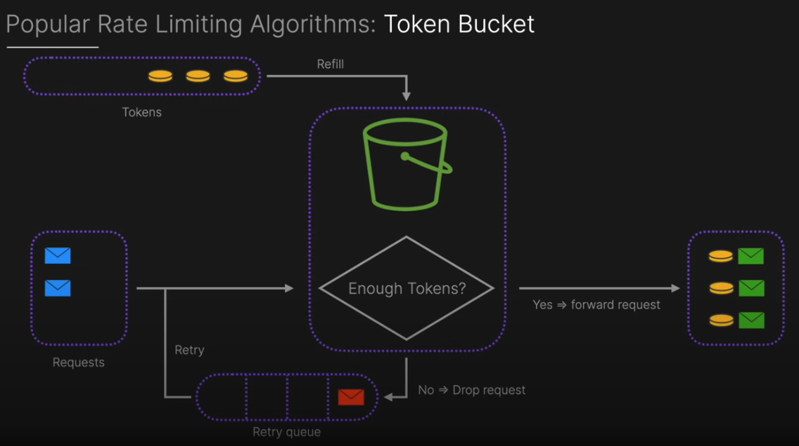
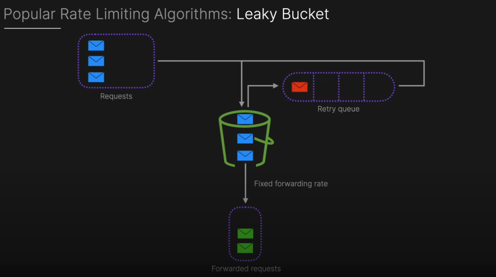
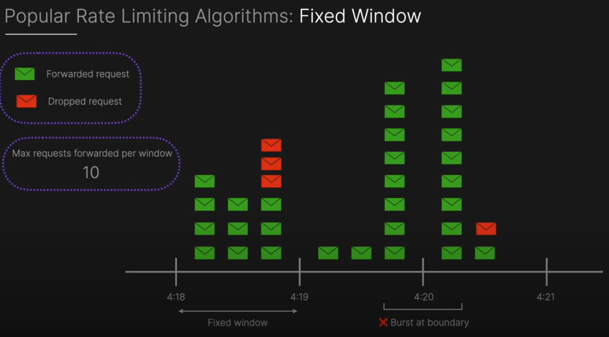
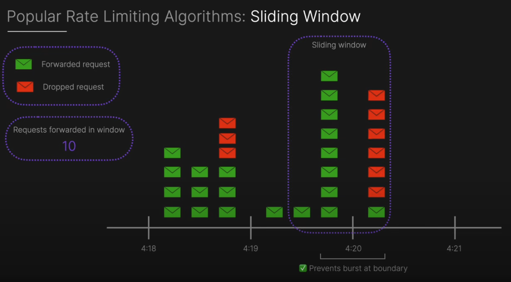

# Rate Limiting

## What is rate limiting?

- Rate limiting is a technique used to control the rate of requests to a service.
- It is used to prevent abuse of the system, also maintain reliability and fairness.
- When rate limit reached, the server will reject the API requests with a `429` error status code

## `Rate limiting` vs `Quotas`

- `Rate limiting`: controls `how often` you can make an API request (eg: 10 requests per second)
- `Quotas`: controls `how much` you can consume over a long period (eg: 1000 requests per day)

## Why rate limiting is important?

- `Specify Rate Limits`: prevent abuse and ensure fair usage of resources.
- `Configurability & Flexibility`: enable system to adapt changing requirements and handle diverse traffic patterns efffectively.
- `Lower Latency & High Performance`: maintaining smooth user experience.

## Types of rate limiting

- `Token bucket`: each request needs a token to proceed, tokens are refilled at a fixed rate (Can add to `retry queue` when token running out).


- `Leaky bucket`: similar like a queue, requests are processed at a constant rate. Excess requests are dropped (Can add to `retry queue` when bucket received too many requests and has to drop some, then drop intoi the queue).


- `Fixed window`: Within the time period, only handle fixed amount of requests, beyond the fixed amount, requests get dropped (Have issue of burst at boundary). 


- `Sliding window`: similar with fixed window, but it's able to continuesly track the previous not executed API requests after time period move to the next window (Aka: sliding window), just slide and check loop (Prevent burst at boundary issue)



## Where to implement rate limiter?

Client side:
- Pros: immediate feedback reduced server load
- Cons: easily bypassed, inconsistent enforcement

Server side:
- Pros: centralised control, enhanced security
- Cons: increased server load, scaability challenges

Middleware:
- Pros: scalable managememt, flexible polices
- Cons: additional complexity, potential bottlenecks


## Example for token bucket

```js
const http = require('http');

class TokenBucket {
  constructor(capacity, refillRatePerSecond) {
    this.capacity = capacity; // 桶的最大容量。比如 10。
    this.tokens = capacity; // 当前桶里的令牌数量。一开始是满的。
    this.refillRatePerSecond = refillRatePerSecond; // 每秒补充多少个令牌。比如 0.5 个/秒。
    this.lastRefillTimestamp = Date.now(); // 上次补充令牌的时间戳。用于计算过了多久。
  }

  _refill() { // _refill() 的作用就是 “更新桶里的令牌数到最新的状态”。它确保了令牌的数量是随时间自动增加的。
    const now = Date.now(); // 现在的时间
    const timePassed = (now - this.lastRefillTimestamp) / 1000; // 计算从上一次更新到现在，过去了多少秒（比如 2.5 秒）
    const tokensToAdd = timePassed * this.refillRatePerSecond; // 根据补充速率，计算这段时间应该加多少令牌（比如 0.5 令牌/秒 * 2.5 秒 = 1.25 个令牌）
    
    if (tokensToAdd > 0) {
      this.tokens = Math.min(this.capacity, this.tokens + tokensToAdd); // 给桶里加令牌，但不能超过桶的最大容量（Math.min）
      this.lastRefillTimestamp = now; // 更新“上次补充时间”为现在，这样下次就从现在开始计算
    }
  }

  // Attempt to consume one token
  tryConsume() {
    this._refill();

    if (this.tokens >= 1) {
      this.tokens -= 1;

      return true;
    }

    return false;
  }

  // Get time until next token is available (in milliseconds)
  getTimeUntilNextToken() {// 这个方法回答了用户最关心的问题：“我还得等多久？”。
    this._refill(); // 同样，先更新令牌到最新状态

    if(this.tokens >= 1) {  // 如果已经有令牌了，不用等（0毫秒）
      return 0;
    }
    // 如果令牌不够（比如现在只有 0.25 个令牌）
    const tokensNeeded = 1 - this.tokens; // 计算还差多少令牌（1 - 0.25 = 0.75）
    // 计算需要的时间：时间 = 需要的令牌量 / 补充速率
     // 比如：0.75个令牌 / 0.5个每秒 = 1.5秒 -> 再转换成毫秒 1.5 * 1000 = 1500ms
    const timeNeeded = (tokensNeeded / this.refillRatePerSecond) * 1000;
    return Math.ceil(timeNeeded); // 向上取整（比如1500.2ms算成1501ms），避免出现0等待
  }
}

class RateLimiter {
  constructor() {
    this.buckets = new Map();

    this.capacity = 10;
    this.refillRatePerSecond = 10 / 60; // actual rate
  }

  getBucket(ip) {
    if (!this.buckets.has(ip)) {
      this.buckets.set(ip, new TokenBucket(this.capacity, this.refillRatePerSecond))
    }

    return this.buckets.get(ip);
  }

  cleanupOldBuckets() {
    if (this.buckets.size > 1000) {
      this.buckets.clear();
    }
  }

  middleware(req, res) {
    const ip = req.socket.remoteAddress;
    const bucket = this.getBucket(ip);

    if (bucket.tryConsume()) {
      // request allowed
      res.setHeader('X-RateLimit-Remaining', Math.floor(bucket.tokens));
      res.setHeader('X-RateLimit-Limit', this.capacity);

      return true;
    } else {
      // request limited
      const retryAfter = bucket.getTimeUntilNextToken();
      res.setHeader('X-RateLimit-Retry-After', Math.ceil(retryAfter / 1000));
      res.writeHead(429, {'Content-Type': 'application/json'});
      res.end(JSON.stringify({
        error: 'Rate limit exceeded, please try again later',
        message: `Rate limit exceeded. Try again in ${Math.ceil(retryAfter / 1000)} seconds.`,
        retryAfter: Math.ceil(retryAfter / 1000)
      }));

      return false;
    }
  }
}

const rateLimiter = new RateLimiter();

const server = http.createServer((req, res) => {
  if (!rateLimiter.middleware(req, res)) {
    return ; // means request limited, stop processing
  }

  if (req.url === '/api/data') {
    res.writeHead(200, {'Content-Type': 'application/json'});
    res.end(JSON.stringify({
      message: 'Data fetched successfully',
      timestamp: new Date().toISOString(),
    }));
  } else {
    res.writeHead(404, {'Content-Type': 'application/json'});
    res.end(JSON.stringify({
      error: 'Not Found',
      message: 'The requested resource was not found on this server.',
    }));
  }

  if (Math.random() < 0.01) { // clean up occasionaly (every 100 requests)
    rateLimiter.cleanupOldBuckets();
  }
});

const APP_PORT = 7634;

server.listen(APP_PORT, () => {
  console.log(`Server running at http://localhost:${APP_PORT}`);
  console.log('Rate limiter configured: 10 requests per minutes per IP');
});

process.on('SIGTERM', () => {
  console.log('SIGTERM signal received. Closing server...');
  server.close(() => {
    console.log('Server closed.');
    process.exit(0);
  });
});

// 首先，一个生活中的比喻
// 想象一个 水桶：

// 容量 (Capacity)：这个水桶最多能装 10 滴水。

// 漏水速率 (Refill Rate)：这个桶的底部有一个小洞，会以固定的速度漏水，比如 每秒漏 1 滴。

// 请求 (Request)：每次你想用一滴水（比如浇花），你就需要从桶里 取出 (consume) 一滴水。

// 规则很简单：

// 只要桶里还有水，你就能随时取水用（请求被允许）。

// 如果桶是空的，你就必须等着，直到有新的水漏下来（请求被拒绝/限流）。

// 这个“水桶”就是我们的“令牌桶”（Token Bucket）。

// ************************************************* Example ************************************************

// 场景模拟：

// 开始时：桶是满的 (tokens = 10)。

// 用户狂发请求：在某一瞬间，用户连续发了 10 个请求。tryConsume() 每次成功，桶很快被取空 (tokens = 0)。

// 第11个请求到来：

// tryConsume() 首先调用 _refill()。假设距离上次取空只过了 2 秒。

// _refill() 计算：2秒 * 0.167个/秒 ≈ 0.33个令牌。所以 tokens 现在不是 0，而是 0.33。

// 0.33 < 1，所以 tryConsume() 返回 false，拒绝请求。

// 用户问要等多久：

// 调用 getTimeUntilNextToken()。

// 它知道当前 tokens = 0.33，需要 1 - 0.33 = 0.67 个令牌。

// 需要时间：0.67 / 0.167 ≈ 4秒。

// 服务器就可以告诉用户：429 Too Many Requests. Retry after 4 seconds.。

// 用户等待后：用户等了 4 秒后再次请求。

// _refill() 计算：又过了4秒，增加了 4 * 0.167 ≈ 0.67 个令牌。加上原来的 0.33，现在 tokens = 1.0。

// tryConsume() 发现 tokens >= 1，消费一个令牌，返回 true，允许请求。同时桶里令牌数变为 0。
```